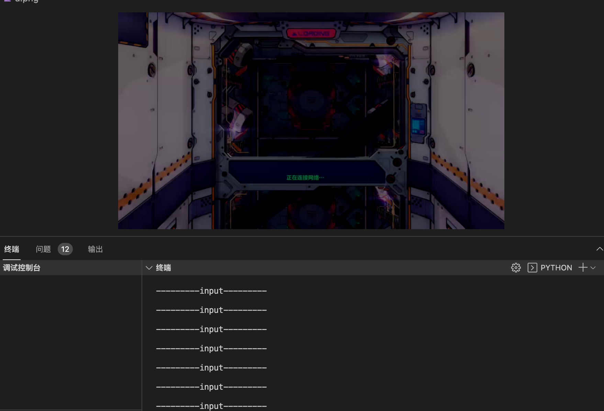

# netease cloud game sdk

Operating on a virtual environment (windows/android) remotely (https://cg.163.com/#/)

Demo: arknights

```python
game_code = "mrfz"
asyncio.get_event_loop().run_until_complete(test(game_code))


```
```bash
python3 ark-demo.py
```


Demo2: 崩3

```python
game_code = "bh3"
asyncio.get_event_loop().run_until_complete(test(game_code))
```



